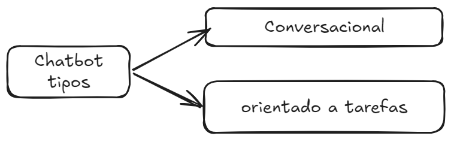
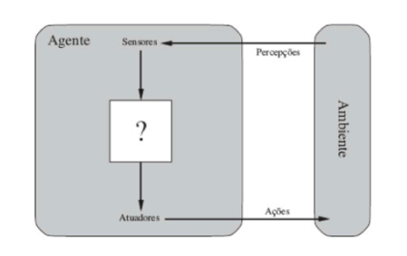
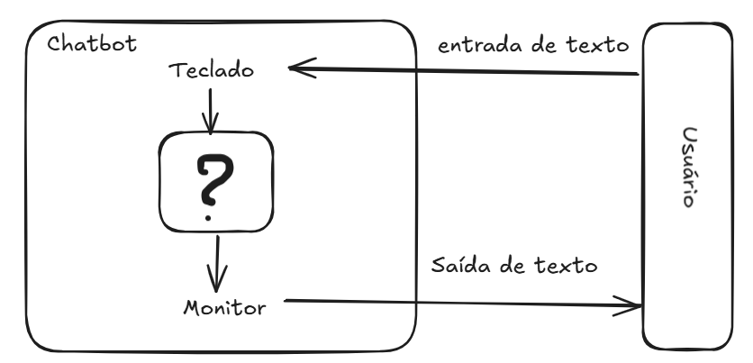
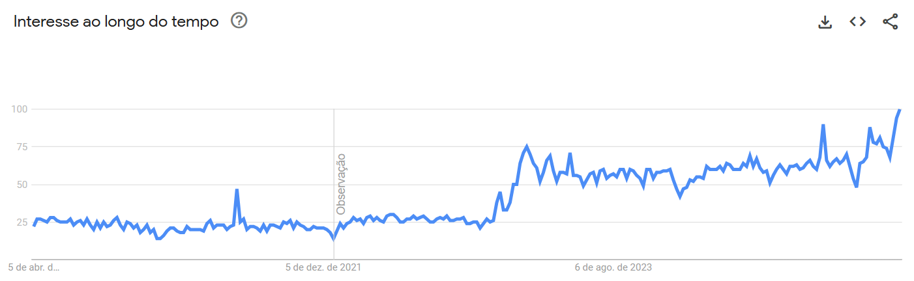
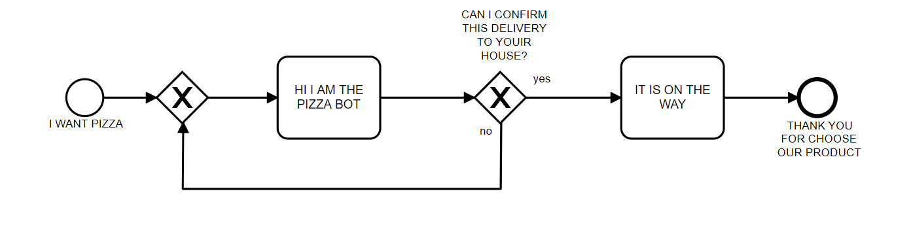
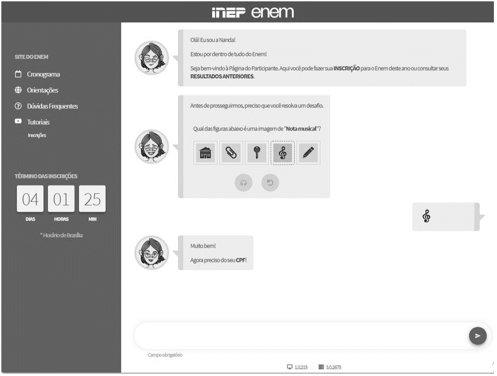

---
author:
- Giseldo Neo
bibliography:
- ref.bib
title: Chatbots
---

# Introdução

Um chatbot é um programa de computador que simula uma conversa humana, geralmente utilizando texto ou áudio. Eles oferecem respostas diretas a perguntas e auxiliam em diversas tarefas, servindo tanto para conversas gerais quanto para ações específicas, como abrir uma conta bancária.

O primeiro chatbot, chamado ELIZA [@Weizenbaum1996], foi criado em 1966 por Joseph Weizenbaum. Este programa representou um experimento revolucionário na interação humano-computador. Seu script mais famoso, DOCTOR, imitava rudimentarmente um psicoterapeuta, utilizando correspondência de padrões simples. Por exemplo, quando um usuário inseria a frase "Estou triste", o ELIZA respondia "Por que você está triste hoje?", reformulando a entrada como uma pergunta. Seu funcionamento baseia-se em um conjunto de regras que lhe permitem analisar e compreender a linguagem humana de forma limitada e aproximada. Esse tipo de aplicação do ELIZA adequou-se bem a esse domínio, pois dependia de pouco conhecimento sobre o ambiente externo; as regras no script DOCTOR permitiam que o programa respondesse ao usuário com outras perguntas ou simplesmente refletisse a afirmação original. O ELIZA não possuía uma real "compreensão" da linguagem humana; ele apenas utilizava palavras-chave e manipulava frases para que a interação parecesse natural. Uma descrição detalhada do funcionamento do ELIZA, com exemplos em Python, será apresentada em seções posteriores.

Outro chatbot famoso é o ChatGPT. Desenvolvido pela OpenAI, este é um modelo de linguagem capaz de gerar texto muito semelhante ao criado por humanos. Ele utiliza aprendizagem profunda (deep learning) e redes neurais para gerar sentenças e parágrafos com base nas entradas e informações fornecidas. É capaz de produzir textos coerentes e até mesmo realizar tarefas simples, como responder a perguntas e gerar ideias. Contudo, é importante lembrar que o ChatGPT não possui consciência nem a capacidade de compreender contexto ou emoções. Ele é um exemplo de Modelo de Linguagem Grande (Large Language Model - LLM), baseado na arquitetura conhecida como Transformers, introduzida em 2017 \[2\]. Esses modelos são treinados com terabytes de texto, utilizando mecanismos de autoatenção que avaliam a relevância de cada palavra em uma frase. Ao contrário das regras manuais do ELIZA, os LLMs extraem padrões linguísticos a partir da vasta quantidade de dados com que a rede neural foi treinada.

Esses dois chatbots, ELIZA e ChatGPT, são bons representantes de chatbots do tipo conversacional. Os chatbots conversacionais são utilizados para interagir sobre um propósito específico ou mesmo sobre assuntos gerais.

Outro tipo de chatbot é o orientado a tarefas. Os chatbots orientados a tarefas executam ações específicas, como abrir uma conta bancária ou pedir uma pizza. Geralmente, as empresas disponibilizam chatbots orientados a tarefas para seus usuários, com regras de negócio embutidas na conversação e com fluxos bem definidos. Normalmente, não se espera pedir uma pizza e, no mesmo chatbot, discutir os estudos sobre Ética do filósofo Immanuel Kant (embora talvez haja quem queira).

Essas duas classificações (Figura [1](#fig:tipo){reference-type="ref" reference="fig:tipo"}) ainda não são suficientes, dada a enorme quantidade de chatbots existentes. Existem outras classificações que serão discutidas em seções posteriores.

<figure id="fig:tipo">

  Fonte: Giseldo Neo (2025)

<figcaption>Tipo de chatbot</figcaption>
</figure>

# Chatbots e Agentes: Definições e Distinções

Define-se chatbot como um programa computacional projetado para interagir com usuários por meio de linguagem natural. Por outro lado, o conceito de agente possui uma definição mais ampla: trata-se de uma entidade computacional que percebe seu ambiente por meio de sensores e atua sobre esse ambiente por meio de atuadores [@Russel2013]. A Figura [2](#fig:agente){reference-type="ref" reference="fig:agente"} ilustra uma arquitetura conceitual de alto nível para um agente.

<figure id="fig:agente">

  Fonte: Diretamente retirado de 

<figcaption>Arquitetura conceitual de um agente.</figcaption>
</figure>

Nesse contexto, um chatbot (Figura [3](#fig:chatbot){reference-type="ref" reference="fig:chatbot"}) pode ser considerado uma instanciação específica de um agente, cujo propósito primário é a interação conversacional em linguagem natural.

<figure id="fig:chatbot">

  Fonte: Giseldo Neo (2025)

<figcaption>Representação esquemática de um chatbot.</figcaption>
</figure>

Com o advento de modelos de linguagem avançados, como os baseados na arquitetura *Generative Pre-trained Transformer* (GPT), observou-se uma recontextualização do termo "agente" no domínio dos sistemas conversacionais. Nessa acepção mais recente, um sistema focado predominantemente na geração de texto conversacional tende a ser denominado "chatbot". Em contraste, o termo "agente" é frequentemente reservado para sistemas que, além da capacidade conversacional, integram e utilizam ferramentas externas (por exemplo, acesso à internet, execução de código, interação com APIs) para realizar tarefas complexas e interagir proativamente com o ambiente digital. Um sistema capaz de realizar uma compra online, processar um pagamento e confirmar um endereço de entrega por meio do navegador do usuário seria, portanto, classificado como um agente, diferentemente de chatbots mais simples como ELIZA, cujo foco era estritamente o diálogo.

Diversos frameworks têm sido desenvolvidos para facilitar a criação desses agentes complexos, como CrewAI e bibliotecas associadas a plataformas como Hugging Face (e.g., Transformers Agents), que fornecem abstrações e ferramentas em Python para orquestrar múltiplos componentes e o uso de ferramentas externas.

A popularidade dos chatbots tem crescido significativamente em diversos domínios de aplicação [@B2020; @Klopfenstein2017; @Sharma2020]. Essa tendência é corroborada pelo aumento do interesse de busca pelo termo "chatbots", conforme análise de dados do Google Trends no período entre 2020 e 2025 (Figura [4](#fig:trends){reference-type="ref" reference="fig:trends"}). Nesta figura, os valores representam o interesse relativo de busca ao longo do tempo, onde 100 indica o pico de popularidade no período analisado e 0 (ou a ausência de dados) indica interesse mínimo ou dados insuficientes.

<figure id="fig:trends">

  Fonte: Google Trends acesso em 05/04/2025

<figcaption>Evolução do interesse de busca pelo termo “chatbot” (Google Trends, 2020-2025).</figcaption>
</figure>

# Origem Terminológica

Embora ELIZA [@Weizenbaum1996] seja frequentemente considerado um dos primeiros exemplos de software conversacional, o termo "chatbot" ainda não era utilizado na época de sua criação. O termo "chatterbot", sinônimo de "chatbot", foi popularizado por Michael Mauldin em 1994, ao descrever seu programa JULIA [@Mauldin1994]. Subsequentemente, o termo também foi registrado em publicações acadêmicas, como nos anais da *Virtual Worlds and Simulation Conference* de 1998 [@Jacobstein1998].

# Gerenciamento do Diálogo e Fluxo Conversacional

A interação textual mediada por chatbots não se constitui em uma mera justaposição aleatória de turnos de conversação ou pares isolados de estímulo-resposta. Pelo contrário, espera-se que a conversação exiba coerência e mantenha relações lógicas e semânticas entre os turnos consecutivos. O estudo da estrutura e organização da conversa humana é abordado por disciplinas como a Análise da Conversação.

No contexto da linguística textual e análise do discurso em língua portuguesa, os trabalhos de Marcuschi [@Marchuschi1986] são relevantes ao investigar a organização da conversação. Marcuschi analisou a estrutura conversacional em termos de unidades coesas, como o "tópico conversacional", que agrupa turnos relacionados a um mesmo assunto ou propósito interacional.

Conceitos oriundos da Análise da Conversação, como a gestão de tópicos, têm sido aplicados no desenvolvimento de chatbots para aprimorar sua capacidade de manter diálogos coerentes e contextualmente relevantes com usuários humanos [@Neves2005]. Na prática de desenvolvimento de sistemas conversacionais, a estrutura lógica e sequencial da interação é frequentemente modelada e referida como "fluxo de conversação" ou "fluxo de diálogo". Contudo, é importante ressaltar que a implementação explícita de modelos sofisticados de gerenciamento de diálogo, inspirados na Análise da Conversação, não é uma característica universal de todos os chatbots, variando conforme a complexidade e o propósito do sistema. Um exemplo esquemático de um fluxo conversacional é apresentado na Figura [5](#fig:fluxo){reference-type="ref" reference="fig:fluxo"}.

<figure id="fig:fluxo">

  Fonte: Giseldo Neo

<figcaption>Exemplo esquemático de um fluxo conversacional em um chatbot.</figcaption>
</figure>

# Depois do ELIZA

No contexto brasileiro, um dos primeiros chatbots documentados capaz de interagir em português, inspirado no modelo ELIZA, foi o Cybele [@primo2001chatterbot]. Posteriormente, desenvolveu-se o Elecktra, também em língua portuguesa, com aplicação voltada para a educação a distância [@Leonhardt2003]. Em um exemplo mais recente de aplicação governamental, no ano de 2019, o processo de inscrição para o Exame Nacional do Ensino Médio (ENEM) foi disponibilizado por meio de uma interface conversacional baseada em chatbot (Figura [6](#fig:enem){reference-type="ref" reference="fig:enem"}).

<figure id="fig:enem">

Fonte: Captura de tela realizada por Giseldo Neo.

<figcaption>Interface de chatbot para inscrição no ENEM 2019.</figcaption>
</figure>

Um marco significativo na evolução dos chatbots foi o A.L.I.C.E., que introduziu a Artificial Intelligence Markup Language (AIML), uma linguagem de marcação baseada em XML [@Wallace2000]. A AIML estabeleceu um paradigma para a construção de agentes conversacionais ao empregar algoritmos de correspondência de padrões. Essa abordagem utiliza modelos pré-definidos para mapear as entradas do usuário a respostas correspondentes, permitindo a definição modular de blocos de conhecimento [@Wallace2000].

O desenvolvimento de chatbots avançados tem atraído investimentos de grandes corporações. Notavelmente, a IBM desenvolveu um sistema de resposta a perguntas em domínio aberto utilizando sua plataforma Watson [@Ferrucci2012]. Esse tipo de tarefa representa um desafio computacional e de inteligência artificial (IA) considerável. Em 2011, o sistema baseado em Watson demonstrou sua capacidade ao competir e vencer competidores humanos no programa de perguntas e respostas JEOPARDY! [@Ferrucci2012].

Diversos outros chatbots foram desenvolvidos para atender a demandas específicas em variados domínios. Exemplos incluem: BUTI, um companheiro virtual com computação afetiva para auxiliar na manutenção da saúde cardiovascular [@Junior2008]; EduBot, um agente conversacional projetado para a criação e desenvolvimento de ontologias com lógica de descrição [@Lima2017]; PMKLE, um ambiente inteligente de aprendizado focado na educação em gerenciamento de projetos [@Torreao2005]; RENAN, um sistema de diálogo inteligente fundamentado em lógica de descrição [@AZEVEDO2015]; e MOrFEu, voltado para a mediação de atividades cooperativas em ambientes inteligentes na Web [@Bada2012].

Desde o pioneirismo do ELIZA, múltiplas abordagens e técnicas foram exploradas para o desenvolvimento de chatbots. Entre as mais relevantes, destacam-se: AIML com correspondência de padrões, análise sintática (Parsing), modelos de cadeia de Markov (Markov Chain Models), uso de ontologias, redes neurais recorrentes (RNNs), redes de memória de longo prazo (LSTMs), modelos neurais sequência-a-sequência (Sequence-to-Sequence), aprendizado adversarial para geração de diálogo, além de abordagens baseadas em recuperação (Retrieval-Based) e generativas (Generative-Based) [@Borah2019; @Ramesh2019; @Shaikh2016; @Abdul-Kader2015; @Li2018], entre outras.

# Problemática

Apesar do progresso recente de chatbots, como o XiaoIce e ChatGPT, o mecanismo fundamental da inteligência no nível humano, frequentemente refletido na comunicação, ainda não está totalmente esclarecido [@Shum2018]. Para resolver esses problemas, serão necessários avanços em muitas áreas da IA cognitiva, tais como: a modelagem empática de conversas, a modelagem de conhecimento e memória, a inteligência de máquina interpretável e controlável e a calibração de recompensas emocionais [@Shum2018].

Uma das dificuldades em construir um chatbot é acompanhar os blocos \"se e então\" de um fluxo de diálogo [@Raj2019]. Quanto maior o número de decisões a serem tomadas, a presença de \"se e então\" é maior. Mas, ao mesmo tempo, esses blocos são necessários para codificar os complexos fluxos de conversação. Se o problema é complexo e exige muito \"se e então\" na vida real, isso exigirá que o código seja ajustado da mesma maneira; para facilitar a visualização destes fluxos, uma solução é utilizar um fluxograma. Eles são simples de escrever e entender, mas são uma poderosa forma de representação para o problema em questão.

Os chatbots AIML apresentam desvantagens particulares, por exemplo, o conhecimento é apresentado como uma instância de arquivos AIML, se o conhecimento for criado com base nos dados coletados da Internet ele não será atualizado automaticamente e deverá ser atualizado periodicamente (MADHUMITHA et al., 2015). Porém, já existem soluções para carregar o AIML a partir de XMLs (MACEDO; FUSCO, 2014), de um corpora (De Gasperis et al., 2013) e do Twitter (YAMAGUCHI et al., 2018).

Outro exemplo de desvantagem AIML é que os seus padrões de correspondência são relativamente complicados, além de ser difícil mantê-lo, pois, embora o conteúdo seja fácil de inserir, uma grande quantidade deve ser inserida manualmente (MADHUMITHA et al., 2015).

No caso do AIML a construção de fluxos de diálogo tem suas próprias dificuldades, muitas vezes é difícil ver como as categorias se vinculam, pois é um formato baseado em texto.

# Chatbot ELIZA em Python

A seguir, apresentamos uma implementação simplificada de um chatbot no estilo ELIZA usando Python. Esse código demonstra o uso de expressões regulares para identificar padrões (palavras-chave) na entrada do usuário e gerar respostas de acordo com regras de transformação definidas manualmente.

    import re  
    import random  

    regras = [
        (re.compile(r'\b(hello|hi|hey)\b', re.IGNORECASE),
         ["Hello. How do you do. Please tell me your problem."]),

        (re.compile(r'\b(I am|I\'?m) (.+)', re.IGNORECASE),
         ["How long have you been {1}?",   
          "Why do you think you are {1}?"]),

        (re.compile(r'\bI need (.+)', re.IGNORECASE),
         ["Why do you need {1}?",
          "Would it really help you to get {1}?"]),

        (re.compile(r'\bI can\'?t (.+)', re.IGNORECASE),
         ["What makes you think you can't {1}?",
          "Have you tried {1}?"]),

        (re.compile(r'\bmy (mother|father|mom|dad)\b', re.IGNORECASE),
         ["Tell me more about your family.",
          "How do you feel about your parents?"]),

        (re.compile(r'\b(sorry)\b', re.IGNORECASE),
         ["Please don't apologize."]),

        (re.compile(r'\b(maybe|perhaps)\b', re.IGNORECASE),
         ["You don't seem certain."]),

        (re.compile(r'\bbecause\b', re.IGNORECASE),
         ["Is that the real reason?"]),

        (re.compile(r'\b(are you|do you) (.+)\?$', re.IGNORECASE),
         ["Why do you ask that?"]),

        (re.compile(r'\bcomputer\b', re.IGNORECASE),
         ["Do computers worry you?"]),
    ]

    respostas_padrao = [
        "I see.",  
        "Please tell me more.",  
        "Can you elaborate on that?"  
    ]

    def response(entrada_usuario):
        """Gera uma resposta estilo ELIZA para a entrada do usuário."""
        for padrao, respostas in regras:
            match = padrao.search(entrada_usuario)  
            if match:
                resposta = random.choice(respostas)
                if match.groups():
                    resposta = resposta.format(*match.groups())
                return resposta
        return random.choice(respostas_padrao)

    print(response("I am feeling sad."))

No código acima, definimos vários padrões regex que representam as palavras-chave de interesse (por exemplo, saudações, frases com "I am", "I need", referências à família, etc.). Quando a função response é chamada com uma string de entrada, ela itera por essas regras na ordem e usa padrao.search(entrada) para verificar se o padrão aparece na frase do usuário.

Ao encontrar um match, seleciona-se uma resposta. Observe que muitas respostas contêm placeholders como 1 -- esses marcadores serão substituídos pelo conteúdo capturado na entrada do usuário. Por exemplo, se o usuário digitar "I am sad", a regex do padrão 2 capturará o grupo ("I am", "sad"), e a resposta escolhida "Why do you think you are 1?" será formatada como \"Why do you think you are sad?".

    print("User: Hello.")
    print("Bot: " + response("Hello."))

    print("User: I am feeling sad.")
    print("Bot: " + response("I am feeling sad."))

    print("Maybe I was not good enough.")
    print("Bot: " + response("Maybe I was not good enough."))

    print("My mother tried to help.")
    print("Bot: " + response("My mother tried to help."))

    Usuário: Hello
    Bot: Hello. How do you do. Please tell me your problem.

    Usuário: I am feeling sad
    Bot: Why do you think you are feeling sad?

    Usuário: Because I lost my job
    Bot: Is that the real reason?

    Usuário: Maybe I was not good enough.
    Bot: You don't seem certain.

    Usuário: My mother tried to help.
    Bot: Tell me more about your family.

Podemos ver que o bot respondeu "Hello\..." à saudação inicial (regra 1), depois detectou "I am sad" e devolveu uma pergunta usando sad (regra 2), seguiu questionando o "Because\..." (regra 8) e reagiu a "Maybe\..." (regra 7), e assim por diante. Cada resposta foi escolhida conforme as regras e conteúdo da frase do usuário, semelhante ao comportamento do ELIZA original.
